# Procesverslag Tijdlijn Winnie the Pooh

## Jij

### Ontwerper:

Ine van den Hoven

#### Je startniveau:

Mijn startniveau is: Rood

# Je plan

<details open>
  <summary>De eerste schetsen van mijn ontwerp & mijn persoonlijke uitdaging</summary>

### De eerste versie/schets:

  

#### Idee 1 - Soort slider

**Waarom past dit bij Winnie the Pooh?**
Als eerste had ik het idee om een soort slider te maken waar je meteen alles kan zien van Winnie the pooh. Dit zou ik kunnen doen met allerlei verschillende honing lagen te maken inplaats van rechte lijnen, zodat het meer bij Winnie the Pooh te laten passen.

#### Idee 2 - Hundred Acre Woods

**Waarom past dit bij Winnie the Pooh?**
Winnie the Pooh is een verhaal dat zich afspeeld in de Hundred Acre Woods. Daarom had ik het idee om een afbeelding van het bos te plaatsen, waar de gebruiker dan om kan inzoomen en dat je op die manier door de jaren heen gaat.

#### Idee 3 - Hunny

**Waarom past dit bij Winnie the Pooh?**
Winnie the Pooh eet heel veel honing. Daarom kreeg ik het idee om iets met een honingpot te doen die honing schenkt en dat er dan steeds iets gebeurd.

#### Idee 4 - Winnie the Pooh film intro

**Waarom past dit bij Winnie the Pooh?**
Aan het begin van veel van de Winnie the Pooh films springt Winnie van letter naar letter en toen had ik het idee om dat na te gaan maken met dan dat hij steeds wat veranderd.

#### Idee 5 - De onderdelen

**Waarom past dit bij Winnie the Pooh?**
Het verhaal Winnie the Pooh begon met een verhaaltje in de krant alleen heette Pooh toen nog geen Winnie the Pooh maar Edward de eerste naam van de teddybeer. Toen de rechten werden gekocht door Slesinger, werd er allerlei verschillende soorten speelgoed gemaakt waaronder muziek. Daarna kreeg disney rechten en werden er films/shortstories gemaakt van het verhaal.

#### Idee 6 - Honingpotten

**Waarom past dit bij Winnie the Pooh?**
Winnie the Pooh houd erg van honing en probeert dit dan ook overal te krijgen. Zo gaat hij bijvoorbeeld een boom in met een bijennest, om honing te kunnen eten of hij gaat bij zijn dieren vrienden langs om daar honing aangeboden te krijgen.

#### Dan nog een idee

Gisteravond heb ik nog een van de Winnie the Pooh films gekeken. Hierin kwam veel terug van de boeken, daarnaast word het boek ook echt gebruikt en bladzijdes omgeslagen. Daardoor kwam ik op het idee om misschien iets met een soort boek te doen.

### Je ambitie:

Aan deze technieken/punten wil ik werken:

- Css animaties/transitions
- Semantisch correcte HTML
- Het schrijven van nette CSS
- Uitdaging zoeken, door bijvoorbeeld een boek met CSS te maken en een SVG te animeren

</details>

<details>
<summary>Schetsen van gekozen ontwerp</summary>

### De schetsen:

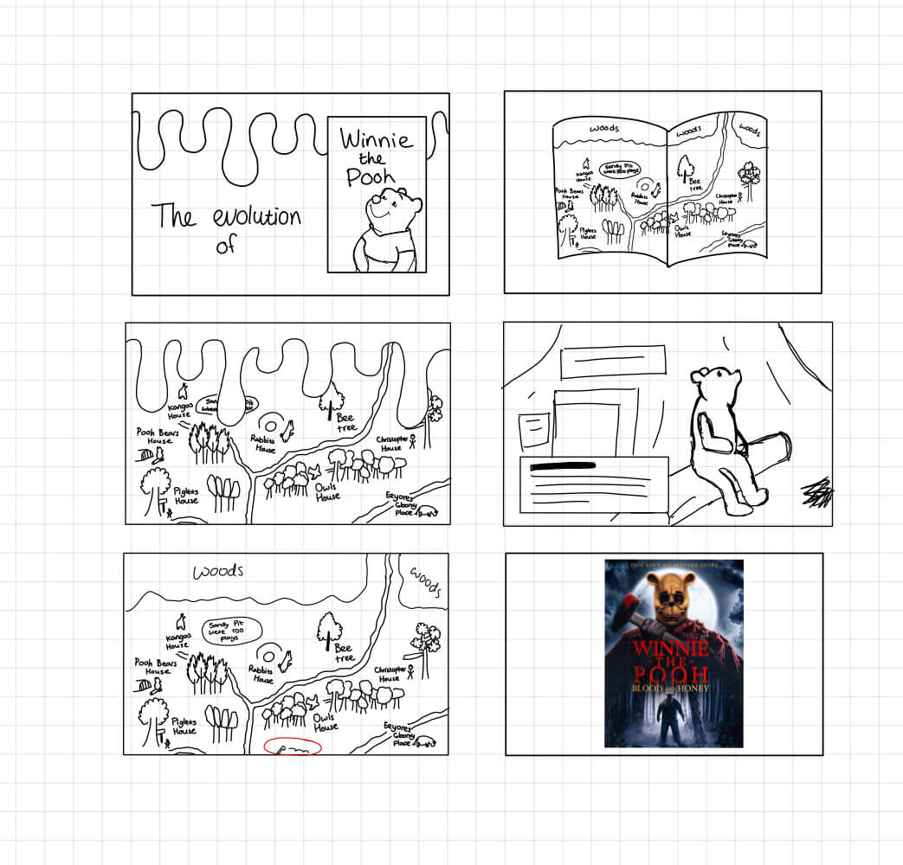

### Mijn idee:

Mijn idee is om mijn tijdlijn te beginnen met een soort beginpagina, waar druipende honing, de titel en het boek. Wanneer je op het boek klikt opent het en zie je de kaart van het Hundred Acre Woods. Op de kaart kun je op verschillende plekken klikken en ga je naar de verschillende jaren waarin Winnie the Pooh is veranderd. Dit gebeurd door in te zoomen op de kaart en dan komt er een nieuwe afbeelding in beeld van uit die tijd met informatie over Winnie the Pooh in die tijd.

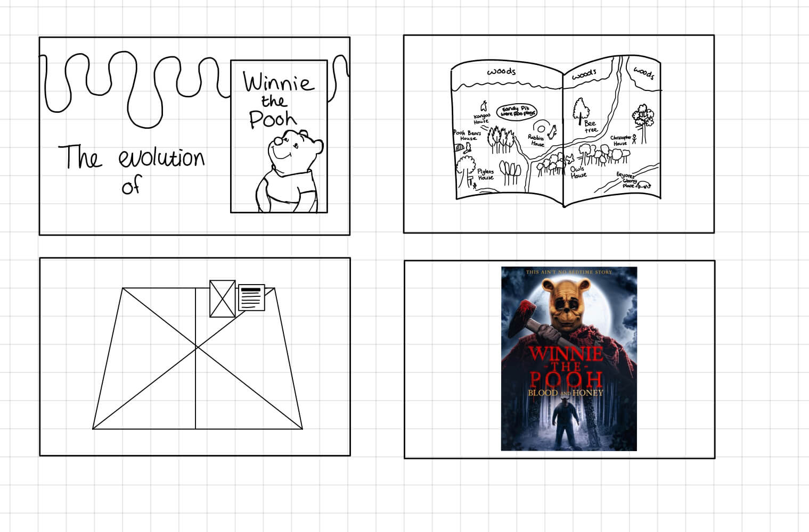

### Uiteindelijke idee:

Het idee is uiteindelijk een beetje aangepast door van het boek een pop-up boek te maken. Er kan op verschillende plekken op de kaart geklikt worden en dan popt er een Winnie the Pooh uit de tijdlijn op met wat informatie.

</details>

## Voortgang/Feedback 1

<details>
  <summary>Mijn bevindingen + wijzigingen</summary>

### Bevinding 1:

Het eerste idee dat ik had geschets van Winnie the Pooh, past niet goed bij de evolutie van Winnie the Pooh.

#### Oplossing:

Dit idee ga ik daarom niet gebruiken, omdat het niet goed past bij Winnie the Pooh en ik het ook een beetje te simple vindt. Daarom ga ik door met de andere ideeën.

### Bevinding 2:

Het tweede idee is het beste idee en daar kan ik andere ideeën ook een beetje in verwerken. Ik kreeg de tip om de kaart te verwerken in een boek, omdat het hele verhaal van Winnie the Pooh daarmee is begonnen.

#### Oplossing:

Ik heb de kaart van de Hundred Acre Woods in het book verwerkt door deze over twee pagina's te verdelen. Hier van heb ik geleerd dat het handig is om gebruik te maken van de aspect-ratio om het zo makkelijker te maken om de afbeeldingen te laten mee schalen. Omdat de afbeelding in twee labels staat moet de ene kant de ene helft van de afbeelding laten zien en het andere label de andere kant.

### Bevinding 3:

Ik moet nog meer nadenken over het toevoegen van eastereggs.

#### Oplossing:

Wanneer je over de rechterhoek onderin van de map hovert komt er een bijl voorbij, wat onderdeel is van de nieuwe horror film die in 2023 uitkomt. Daarnaast is de poster van de horror film op de achterkant ook een soort easteregg.

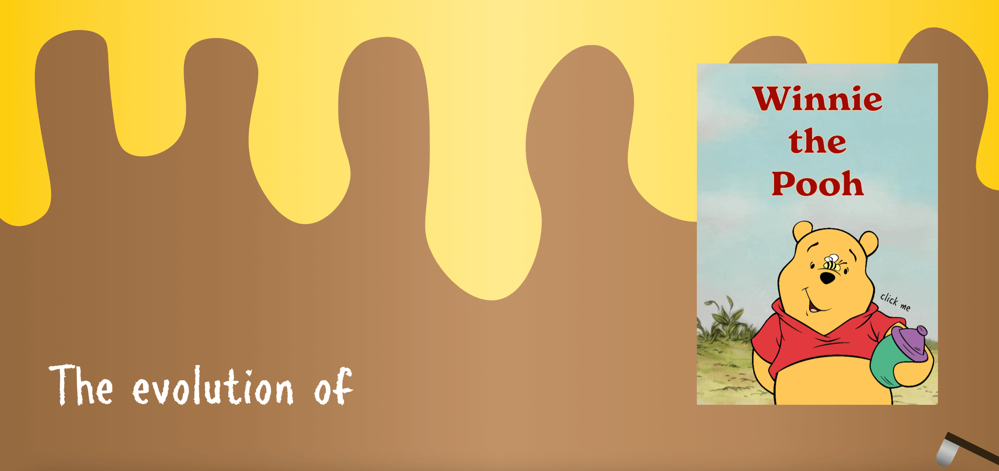

### Bevinding 4:

Honing idee toevoegen aan idee 2.

#### Oplossing:

Ik heb het idee om iets met honing te doen toegevoegd aan mijn idee door aan de bovenkant van de pagina een soort honing druip effect te creeëren. Dit was een hele opgave om voor elkaar te krijgen. Eerst heb ik het geprobeerd met <animate> maar dit werkte helaas niet. Daarna heb ik met de docent geprobeerd om met GreenSock Morph SVG de animatie werkend te krijgen. Dit is uiteindelijk na veel proberen en een goede SVG te maken gelukt.

### Bevinding 5:

Leuke animaties toevoegen aan het boek en de rest van de website. Bijvoorbeeld bijtjes die rond vliegen en honing dat animeerd.

#### Oplossing:

Wanneer je het boek opent animeert deze naar het midden en wanneer je op de kaart op de buttons klikt animeren deze ook naar boven.

</details>

## Voortgang/Feedback 2

<details>
  <summary>Mijn bevindingen + wijzigingen</summary>
  
  ### Bevinding 1:
  Het is nu nog niet duidelijk dat je op het boek kan klikken.

#### Oplossing:

Dit zou ik kunnen oplossen door een hover state te maken dat de pagina al een beetje roteert of er echt click me op te zetten. Dit is helaas niet gelukt omdat de pagina dan achter de andere pagina's verdwijnt, dan zou het opgelost moeten kunnen worden door de andere pagina's ook mee te laten roteren maar dan was het effect weg. Daarom heb ik het uiteindelijk opgelost door op de kaft click me te zetten naast dat de muis een handje wordt.

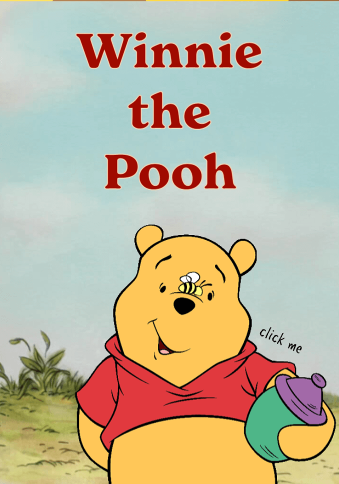

### Bevinding 2:

Op de kaart duidelijker maken waar je kunt klikken, nu is dat alleen duidelijk door dat er een handje komt.

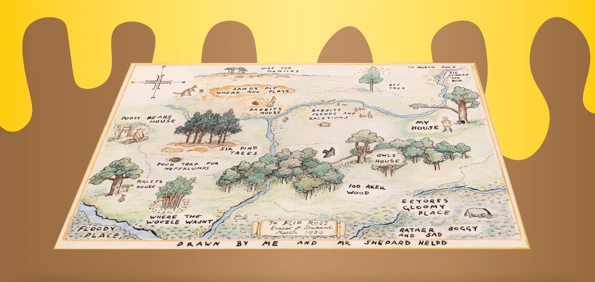

#### Oplossing:

Dit zou ik aan kunnen passen door om het gebied een border te plaatsen. Dit heb ik gedaan doormiddel van een achtergrond afbeelding op de button te plaatsen. Zodat het er hetzelfde uit komt te zien als de randen om de kaart.

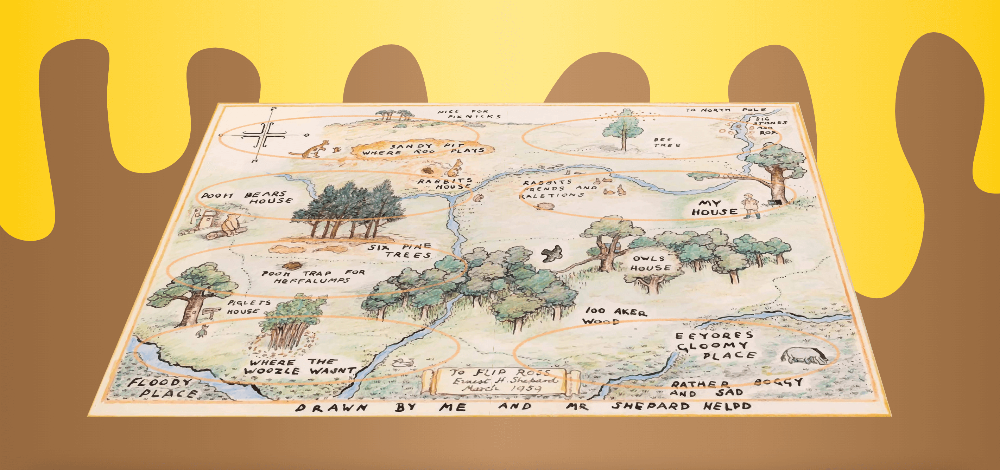

### Bevinding 3:

Nu kun je alle popups van Winnie the Pooh tegelijk openen waardoor ze over elkaar vallen.

#### Oplossing:

Oplossen door ervoor te zorgen dat wanneer je er een opent de andere sluiten. Dit heb ik opgelost met JavaScript door remove class toe te voegen.

### Bevinding 4:

Responsive gaat hij nog niet helemaal goed.

#### Oplossing:

Goed kijken waar het niet goed gaat en dit met media queries oplossen. Dit heb ik gedaan met de volgende code.

### Bevinding 5:

Responsive gaat hij nog niet helemaal goed.

#### Oplossing:

Goed kijken waar het niet goed gaat en dit met media queries oplossen. Dit heb ik gedaan met de volgende code.

</details>

## Voortgang/Feedback 3

<details>
  <summary>Mijn bevindingen + wijzigingen</summary>
  
  ### Bevinding 1:
  Shadow toevoegen aan het boek, zodat het meer lijkt alsof het boek ligt.

#### oplossing:

Doormiddel van het toevoegen van een box-shadow op de class map is het gelukt om een shadow te laten zien wanneer het boek is geopend.

### Bevinding 2:

Responsive gaat vanaf 1536px niet helemaal goed. Dan valt Winnie the Pooh Disney jaartal buiten het scherm.

#### oplossing:

Door het toevoegen van de volgende code gaat het goed en valt de tekst niet meer van het scherm.

```
@media only screen and (min-width: 1536px) {
  main section label ol li div p {
    font-size: 1em;
  }
}
```

### Bevinding 3:

Niet duidelijk waar je moet beginnen met de tijdlijn.

#### oplossing:

Dit ga ik niet aanpassen omdat het de bedoeling is dat het van onder naar boven en van boven naar onder gaat. Hiervoor heb ik gekozen, omdat de gebruiker zo willekeurig door de tijdlijn kan gaan.

### Bevinding 4:

Shadow achter afbeelding popup. Zodat het duidelijker word.

#### oplossing:

Ik heb geprobeerd om dit toe te voegen maar is helaas niet gelukt. Wanneer ik een shadow wilde toevoegen ging er steeds wat kapot.

### Bevinding 5:

Honing rood maken wanneer het boekje dicht is, zodat het beter gaat passen bij het horror element.

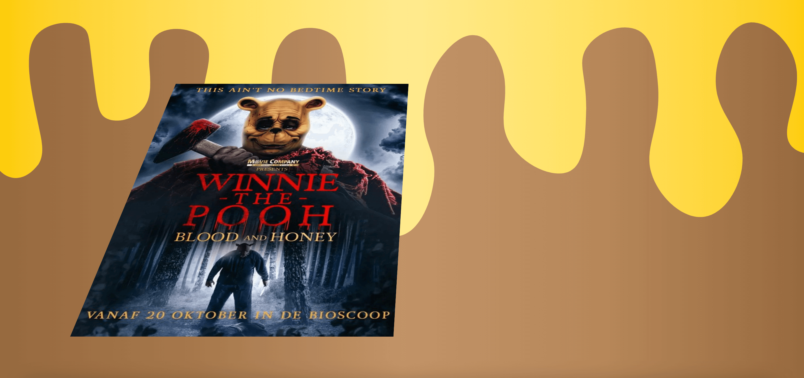

#### oplossing:

Dit heb ik toegevoegd door middel van een nieuwe gradient aan de svg toe te voegen.

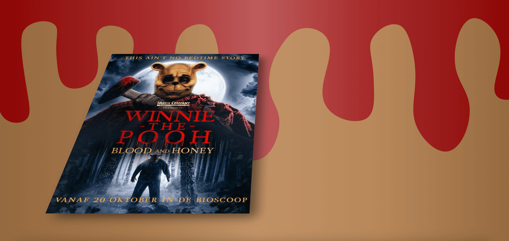

</details>

## Reflectie

<details>
  <summary>Mijn eindresultaat & persoonlijke ontwikkeling</summary>

### Je uitkomst - karakteristiek screenshot(s):

#### Beginscherm:

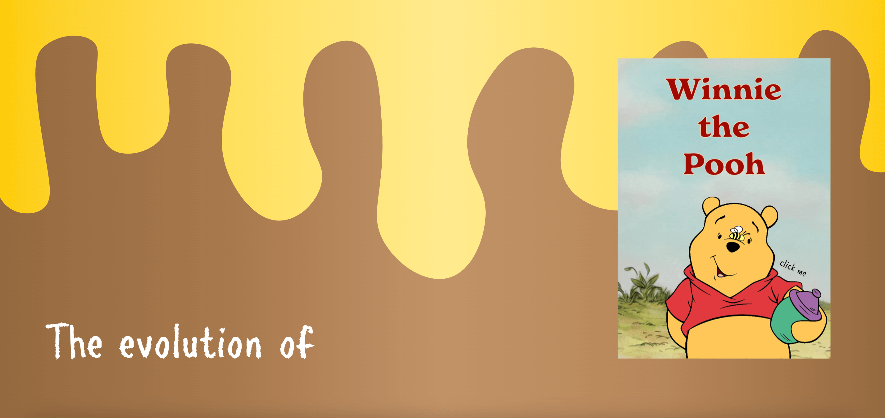

#### Boek open:

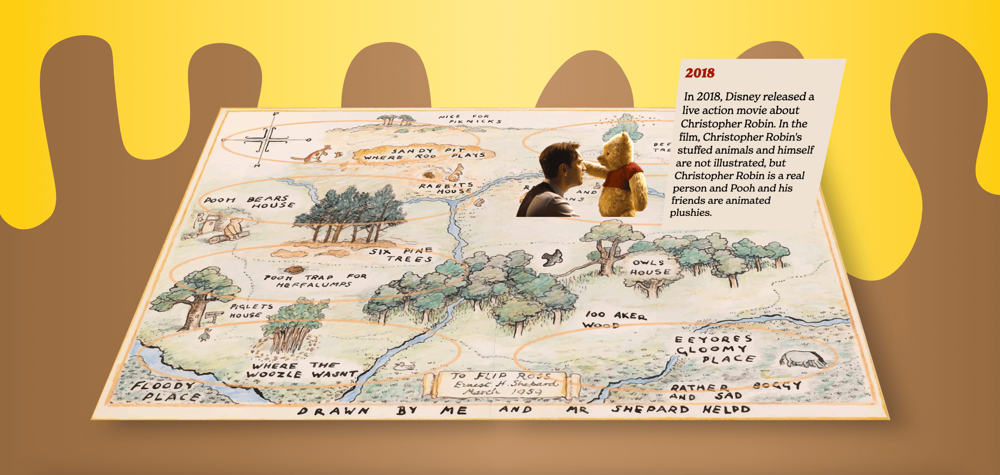

#### Achterkant boek:


### Dit ging goed/Heb ik geleerd:

Wat ik heb geleerd gedurende dit project is het werken met CSS perspective. Dit vond ik erg lastig, maar met hulp heb ik er wel veel van geleerd en is het ook gelukt om het boek zo te krijgen dat het lijkt alsof het ligt.

  

Wat goed ging het het honing veranderen in een bloedkleur, wanneer de gebruiker naar de achterkant van het boek gaat.


Wat ook goed ging was het ervoor zorgen dat de popups overeind komen met een animatie. Het was even uitvogelen waar de transitie precies moest, maar het is gelukt.

### Dit was lastig/Is niet gelukt:

Wat erg lastig was om te maken was de honing animatie. Hier waren verschillende mogelijkheden voor, maar met animate werkte het helaas niet. Daarom hebben we gebruikt gemaakt van een plugin genaamd MorphSVG van GreenSock.

Het is niet gelukt om de pagina geheel responsive te maken, omdat dit erg lastig is met een boek dat open klapt. Daarom is de pagina alleen te gebruiken grote tabelets tot een scherm van 2048px.

  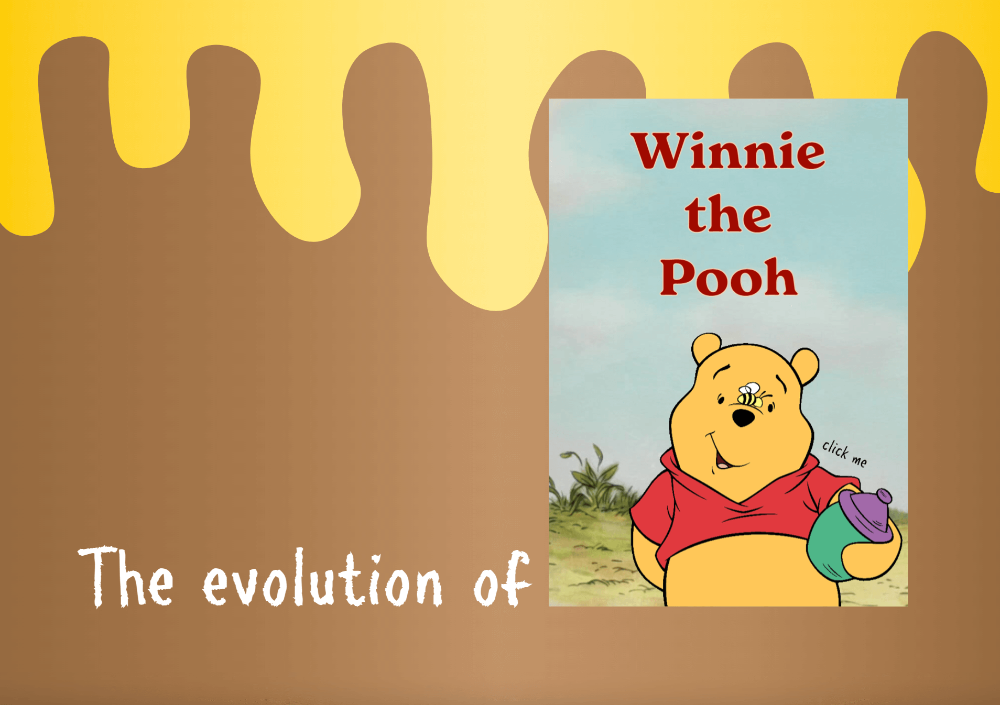

Wat ik lastig vond is perspective en javascript. Op sommige momenten raak ik zo in de war dat ik even niet meer weet hoe het nou allemaal moet. Maar met uitleg en iemand die het voordoet ga ik het steeds meer begrijpen en leer ik ook steeds meer.

</details>

## Bronnenlijst

<details open>
  <summary>continu bijhouden terwijl je werkt</summary>

### Website sources

1. https://stackoverflow.com/questions/107701/how-can-i-remove-ds-store-files-from-a-git-repository
2. https://codepen.io/shooft/pen/ExNLMyr
3. https://developer.mozilla.org/en-US/docs/Web/CSS/transform-origin
4. https://developer.mozilla.org/en-US/docs/Web/CSS/backface-visibility
5. https://greensock.com/forums/topic/18708-reverse-a-morph-and-then-fluidly-repeat-from-the-start/
6. https://greensock.com/morphsvg/
7. https://developer.mozilla.org/en-US/docs/Web/SVG/Attribute/viewBox
8. https://developer.mozilla.org/en-US/docs/Web/SVG/SVG_animation_with_SMIL
9. https://www.w3schools.com/cssref/tryit.php?filename=trycss3_perspective1
10. https://developer.mozilla.org/en-US/docs/Web/CSS/pointer-events
11. https://gomakethings.com/how-to-get-the-next-and-previous-siblings-of-an-element-with-vanilla-js/
12. https://developer.mozilla.org/en-US/docs/Web/CSS/cursor
13. https://developer.mozilla.org/en-US/docs/Web/CSS/-webkit-text-stroke
14. https://stackoverflow.com/questions/14051351/svg-gradient-using-css
15. https://www.cssmatic.com/box-shadow
16. https://stackoverflow.com/questions/9419263/how-to-play-audio
17. https://stackoverflow.com/questions/37674223/domexception-failed-to-load-because-no-supported-source-was-found

### Image sources

1. https://www.disneyclips.com/images2/images/0156.gif
2. https://www.disneyclips.com/images/images/winnie-the-pooh-honey2.png
3. https://www.disneyclips.com/images2/images/winnie-honey5.png
4. https://i.etsystatic.com/17676578/r/il/54b33a/3289301498/il_fullxfull.3289301498_p1j3.jpg
5. https://media.pathe.nl/nocropthumb/620x955/gfx_content//api/filmdepot/v1/movie/download/34656/34656_154003_ps_sd-high.jpg
6. https://s1.dmcdn.net/v/O2zeE1RPFPBSBI6Hj/x1080
7. https://lh3.googleusercontent.com/ci/AC_FhM_AsQAHoFMFw-1sQTUjjIFRPYMWWG8JNdWH_2l6t1TjFYdmDlURLXQa0GAkc28kiT9lElmfAkmu=s1200
8. https://images0.persgroep.net/rcs/VHDMWyYRzVmshLwVi_Hf7CGM5Rg/diocontent/68979126/_fitwidth/694/?appId=21791a8992982cd8da851550a453bd7f&quality=0.8
9. https://cdn.britannica.com/53/166453-050-BCA1C96E/Winnie-the-Pooh-illustration-Piglet-EH-Shepard.jpg
10. https://upload.wikimedia.org/wikipedia/en/thumb/3/3e/Pooh_Shepard1928.jpg/1200px-Pooh_Shepard1928.jpg
11. https://images.mubicdn.net/images/film/30795/cache-21653-1538711069/image-w1280.jpg
12. https://thewallpapers.org/zoom/37749/winnie-the-pooh-127.jpg

</details>
